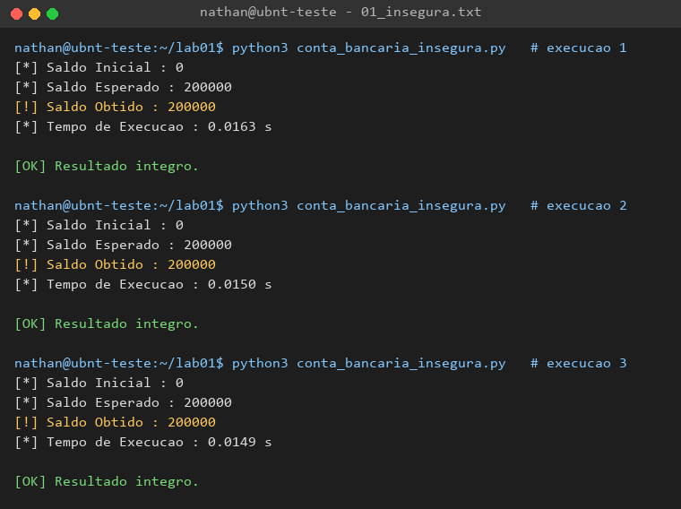
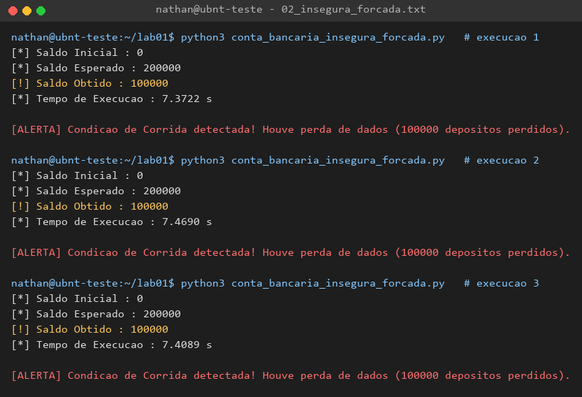
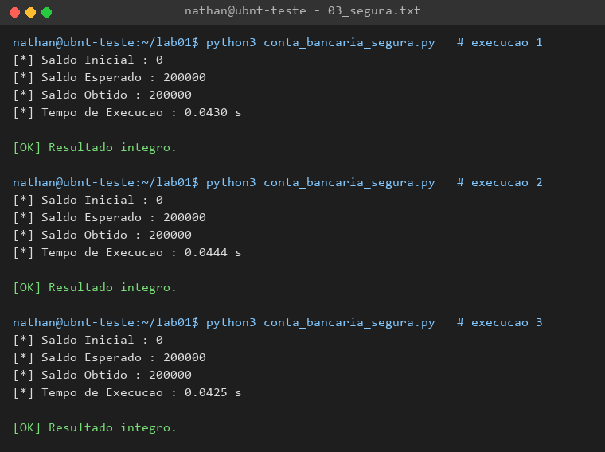
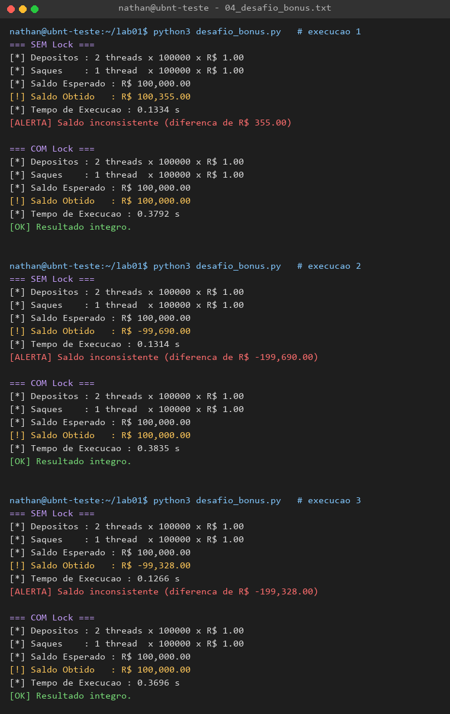
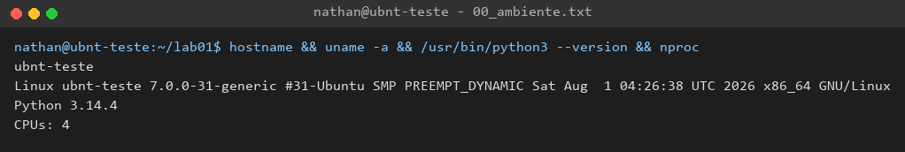

# Lab 01 — Concorrência, Threads e Race Conditions

**Disciplina:** Sistemas Operacionais (2026.2) — UNIFADESA, ADS
**Docente:** Prof. Esp. Rodrigo Martins Sousa
**Aluno:** Nathan
**Ambiente de testes:** servidor Ubuntu 26.04 LTS `ubnt-teste`, Python 3.14.4, 4 CPUs (detalhes em [`evidencias/00_ambiente.txt`](evidencias/00_ambiente.txt))

---

## Estrutura do repositório

| Arquivo | Descrição |
|---|---|
| [`conta_bancaria_insegura.py`](conta_bancaria_insegura.py) | Parte 1 — código do roteiro, sem sincronização (com medição de tempo adicionada) |
| [`conta_bancaria_insegura_forcada.py`](conta_bancaria_insegura_forcada.py) | Parte 1 — variante com `time.sleep(0)` na seção crítica para forçar a troca de contexto |
| [`conta_bancaria_segura.py`](conta_bancaria_segura.py) | Parte 2 — seção crítica protegida por `threading.Lock()` |
| [`desafio_bonus.py`](desafio_bonus.py) | Desafio extra — 2 threads de depósito + 1 de saque, sem e com Lock |
| [`executar_testes.sh`](executar_testes.sh) | Roda todos os testes e grava as saídas em `evidencias/` |
| [`gerar_prints.py`](gerar_prints.py) | Converte os logs de `evidencias/` em capturas PNG em `prints/` |
| `evidencias/` | Saídas brutas (texto) de cada execução |
| `prints/` | Capturas de tela das execuções |

### Como reproduzir

```bash
bash executar_testes.sh          # roda tudo e salva em evidencias/
python3 gerar_prints.py          # gera os PNGs em prints/ (requer Pillow)
```

---

## Parte 1 — Provocando a Condição de Corrida

Duas threads (`Thread-Caixa-1` e `Thread-App-2`) fazem 100.000 depósitos cada numa variável global, sem nenhum controle. O saldo esperado é 200.000.



> **Observação importante:** a partir do Python 3.10, o interpretador CPython só troca de thread em pontos específicos do bytecode (saltos de volta no laço e chamadas de função). No código original não há nenhum desses pontos entre `temp = saldo_conta` e `saldo_conta = temp`, então dependendo da versão do Python o erro pode **não aparecer**, mesmo com o código incorreto. O problema continua existindo: basta uma troca de contexto no lugar errado.
>
> Para mostrar isso, a variante [`conta_bancaria_insegura_forcada.py`](conta_bancaria_insegura_forcada.py) coloca `time.sleep(0)` no meio da seção crítica. Isso libera o GIL e pede ao SO para escalonar outra thread, simulando a pior troca de contexto possível:



## Parte 2 — Exclusão Mútua com Mutex (Lock)

Com a seção crítica dentro de `with lock_bancario:`, apenas uma thread por vez executa a sequência ler → somar → escrever. O saldo é sempre 200.000.



## Desafio Extra — 2 depósitos + 1 saque

Três threads: duas depositam R$ 1,00 e uma saca R$ 1,00, 100.000 vezes cada. O saldo esperado é 2 × 100.000 − 100.000 = **R$ 100.000,00**. O script roda o cenário sem Lock (resultado incorreto) e com Lock (resultado correto).



---

## Resultados no servidor

**Ambiente:** `ubnt-teste`, Ubuntu 26.04 LTS, kernel Linux 7.0.0-31-generic (PREEMPT_DYNAMIC), x86_64, 4 CPUs, Python 3.14.4.



| Script | Exec. 1 | Exec. 2 | Exec. 3 | Esperado | Tempo médio |
|---|---|---|---|---|---|
| `conta_bancaria_insegura.py` | 200.000 | 200.000 | 200.000 | 200.000 | 0,0154 s |
| `conta_bancaria_insegura_forcada.py` | **100.000** ❌ | **100.000** ❌ | **100.000** ❌ | 200.000 | 7,4167 s |
| `conta_bancaria_segura.py` | 200.000 ✅ | 200.000 ✅ | 200.000 ✅ | 200.000 | 0,0433 s |
| `desafio_bonus.py` — SEM Lock | **R$ 100.355** ❌ | **R$ −99.690** ❌ | **R$ −99.328** ❌ | R$ 100.000 | 0,1305 s |
| `desafio_bonus.py` — COM Lock | R$ 100.000 ✅ | R$ 100.000 ✅ | R$ 100.000 ✅ | R$ 100.000 | 0,3774 s |

**Análise:**

- **Código original sem Lock:** deu 200.000 nas três execuções. Isso **não** significa que o código está certo. No Python 3.14, a troca entre threads só pode acontecer em pontos específicos do bytecode, e a sequência ler → somar → escrever cabe entre dois desses pontos. O erro está lá, só não teve oportunidade de aparecer. Em outra versão do Python, em outra linguagem ou com uma operação mais longa, ele aparece.
- **Versão forçada:** perdeu exatamente metade dos depósitos, sempre. No Linux, `sleep(0)` vira `sched_yield()`, e com duas threads as duas se alternam em sincronia perfeita: a thread A lê *x*, cede a CPU, a B lê o mesmo *x*, cede, a A grava *x+1*, a B grava *x+1*. Todo par de depósitos vira um só. Esse é o pior caso de uma condição de corrida.
- **Versão com Lock:** 200.000 em todas as execuções. Ficou cerca de 2,8× mais lenta que a versão sem Lock (ver Questão 2).
- **Desafio bônus:** sem Lock, o saldo varia muito a cada execução e chega a ficar **negativo** (R$ −99.690), porque as escritas dos saques sobrescrevem as dos depósitos e vice-versa. Com Lock, o saldo é sempre exatamente R$ 100.000,00. No bônus a troca de contexto é forçada em apenas ~1% das operações, em pontos aleatórios. Quando o `sleep(0)` acontecia em toda operação, as três threads entravam em sincronia perfeita e, em alguns testes, as perdas de depósito e de saque se cancelavam e davam R$ 100.000 por coincidência. Isso também mostra como uma condição de corrida pode passar despercebida.

---

## Questões

### 1. Troca de Contexto e Atomicidade

O incremento parece uma operação única no código-fonte, mas a CPU o executa em **três etapas separadas**:

1. **Leitura (LOAD):** o valor de `saldo_conta` é copiado da memória para um registrador (ou, no Python, para a pilha do interpretador: `LOAD_GLOBAL`).
2. **Modificação (ADD):** o valor é incrementado no registrador (`BINARY_OP +`).
3. **Escrita (STORE):** o resultado volta para a memória (`STORE_GLOBAL`).

Em Python isso é ainda maior: cada linha vira várias instruções de bytecode, e cada instrução de bytecode vira dezenas de instruções de máquina. Nenhuma dessas sequências é **atômica**, ou seja, o SO pode interromper a thread entre qualquer uma delas.

O escalonador do SO faz **troca de contexto** por preempção (fim do *quantum* de tempo, interrupção de hardware, chamada de sistema). Ele salva os registradores da thread atual e coloca outra para rodar. Se isso acontecer entre a leitura e a escrita, ocorre a perda:

| Tempo | Thread-Caixa-1 | Thread-App-2 | `saldo_conta` |
|---|---|---|---|
| t1 | `temp = saldo_conta` → lê 100 | | 100 |
| t2 | *(preemptada — contexto salvo com temp=100)* | `temp = saldo_conta` → lê 100 | 100 |
| t3 | | `temp = 101`; `saldo_conta = 101` | 101 |
| t4 | *(retoma)* `temp = 101`; `saldo_conta = 101` | | **101** ❌ |

Dois depósitos foram feitos, mas o saldo aumentou apenas 1. A segunda escrita **sobrescreveu** a primeira com um valor calculado a partir de um dado desatualizado. Isso é uma **condição de corrida**: o resultado depende da ordem imprevisível em que o escalonador intercala as threads. Por isso o valor final varia a cada execução.

No CPython existe o **GIL** (*Global Interpreter Lock*), que impede duas threads de executarem bytecode ao mesmo tempo. Mas o GIL **não protege o código do usuário**: ele é liberado e retomado entre instruções de bytecode, então a sequência LOAD → ADD → STORE continua podendo ser interrompida no meio. O GIL protege o interpretador, não a lógica do programa.

### 2. Custo do Lock

Tempos medidos no servidor (média de 3 execuções, 200.000 operações no total):

| Versão | Tempo médio | Resultado |
|---|---|---|
| Insegura (sem Lock) | 0,0154 s | correto por sorte |
| Segura (com Lock) | 0,0433 s | sempre correto |
| **Diferença** | **≈ 2,8× mais lenta** | |

No desafio bônus, a proporção se repete: 0,1305 s sem Lock contra 0,3774 s com Lock (≈ 2,9×).

A versão com Lock é mais lenta porque a exclusão mútua tem custo:

- **Aquisição e liberação a cada iteração:** são 200.000 operações de `acquire()` + `release()`. Cada uma usa instruções atômicas de hardware (*compare-and-swap*, `LOCK CMPXCHG` no x86), que travam a linha de cache e forçam sincronização de memória entre núcleos.
- **Chamadas ao kernel:** quando o lock já está ocupado, a thread não pode continuar. O Python usa primitivas do SO (no Linux, `futex` / `pthread_mutex`); a thread faz uma chamada de sistema, sai do modo usuário e vai para o modo kernel, e fica **bloqueada** até ser acordada.
- **Trocas de contexto extras:** a thread bloqueada é tirada da CPU e outra entra. Salvar e restaurar registradores, trocar pilhas e invalidar caches custa microssegundos a cada vez.
- **Serialização:** a seção crítica passa a ser executada em série. O paralelismo que as threads ofereceriam desaparece durante o trecho protegido.
- **Overhead do gerenciador de contexto:** o `with` chama `__enter__` / `__exit__`, o que acrescenta chamadas de função Python em cada iteração.

É o custo da **corretude**: sem o Lock o programa é mais rápido, mas produz dados errados. Na prática, reduzimos esse custo deixando a seção crítica o menor possível, ou agrupando operações (por exemplo, somar localmente e fazer uma única atualização protegida no fim).

### 3. Desafio Extra (Bônus)

Implementado em [`desafio_bonus.py`](desafio_bonus.py). A classe `ContaBancaria` concentra a seção crítica em `movimentar(delta)`, protegida por um `Lock` que é **compartilhado** pelas três threads. Depósitos e saques mexem na mesma variável, então todos precisam do mesmo lock. Se cada operação tivesse seu próprio lock, não haveria exclusão mútua entre depósito e saque.

- **Sem Lock:** saques e depósitos se sobrescrevem. No servidor, o saldo final foi R$ 100.355, R$ −99.690 e R$ −99.328.
- **Com Lock:** o saldo final foi exatamente **R$ 100.000,00** nas três execuções.

---

## Conclusão

Threads de um mesmo processo compartilham o espaço de endereçamento, o que torna a comunicação entre elas simples, mas perigosa. Qualquer sequência ler → modificar → escrever sobre dados compartilhados é uma **seção crítica** e precisa de **exclusão mútua**. O Mutex (Lock) garante a integridade dos dados em troca de desempenho, e esse custo aumenta com a quantidade de disputas pelo lock.
